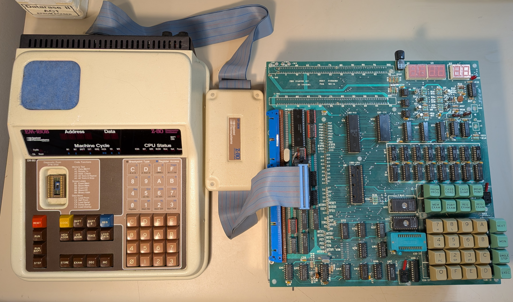

# Z80StarterKit
Programming a Z80 like it was 1979. A rescued S.D. Systems Z80 Starter Kit and Applied Microsystems EM180 Diganostic Emulator. I'm restoring it to working order.

# Details

The S.D. Systems Z80 Starter Kit and Applied Microsystems EM180 Diganostic Emulator are both from the Trenton Computer Festival at Mercer County College, NJ (1992). I ended up getting the Z80 Start Kit for $20 and the EM180 for $10. I had been fortunate enough to worked with the EM189 (6809) version back in the 80's. 

I'll get better pictures later. The Z80 Starter Kit was used at Mercer to teach hardware and assembly language. The unit I have is one of their kits carefully assembled by the MCC staff. Under the main board is a wire wrapped static RAM board. If you've ever done wire wrap you can appreciate the amount of work and this one is pretty. Actually the whole thing is pretty and I'm pretty sure these (there would be about a dozen for student labs) were hand made. 

I have a number of these types of development board (8085, 6800, 6809, 68HC11, 68000, etc.) because I started with an Intel SDK-85 (8085) in college. My first computer was an Atari 800xl (still have it and it works). My first job after college was a repair tech at a company that made communication equipment for the newspaper industry (Microcomm - not the modem maker). There I worked with a lot of Motorola products and came to like the Motorola chip set.
